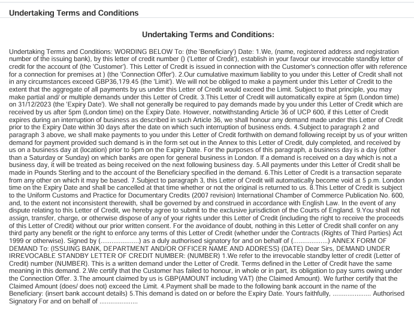
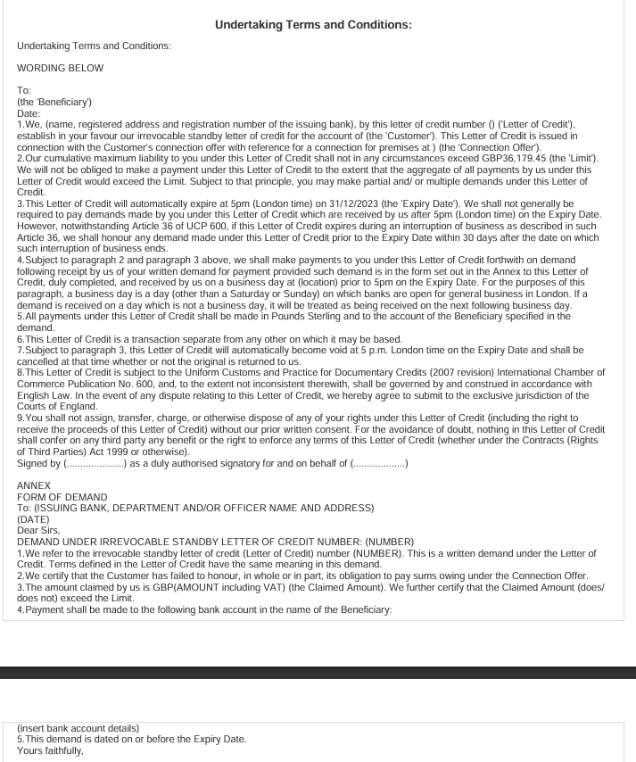

#Release V1.0
###New Features:
* Monitor code added
    * Whenever any of the following messages/emails are not generated, an email will be sent to support giving the details of the transactions for whom these are not generated.
        * Missing Swift Outbound Message Monitor
        * Missing delivery object Monitor 
        * Missing External Contacts Monitor
    
###Bug Fixes:
* Import Lc Print Issue.
    * Formatting error of not preserving new line is now fixed.
     ####Before

####Now

* Import LC List Screen Issue
    * When we copy an import lc from import transaction list. If import lc has value in CTP with name '"Internal Corporate Ref's" then Import Transaction List was not working.

